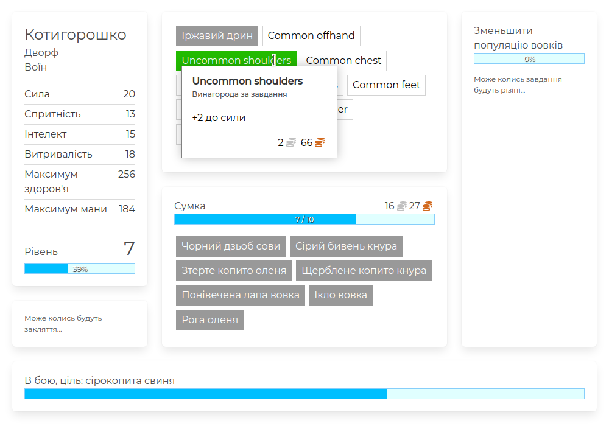

# Progress Quest Next

- [Demo](https://greenya.github.io/pqnext/)
- Original idea: [ProgressQuest](http://progressquest.com/)
- Awesome reincarnation: [pq-cli](https://github.com/rr-/pq-cli)

## Screenshot



## Bundle

```
deno run --unstable --allow-net --allow-read --allow-write bundle.ts
```

## Debug

```
deno run debug.ts
```

## Todos and Ideas

- add value to attributes:
    + str (more bag slots),
    - dex (lesser chance to die),
    + int (more mana allows longer non-stop combat; each mob takes portion of mana; when no mana -> "rest" action)
- add dying; on death -> run to corpse (50% of town distance) -> eat-and-drink
- add chance to fail when fighting mob; removes a lot of gear durability and takes time to run to corpse

- add gear slot items limit when generating name; should be a window of 6-8 items that moves down the list; so at high levels we generate random name from last 6-8 item names (or maybe add optional properly "level-limit" so it is posible to manually limit some weak titles for high levels) (or maybe allow optionally define rarities for gear slot item titles; so no rare and epic weak titles generated)

- add weapon depth (mainhand and offhand slots)
    - melee/ranged weapons; hero class defines what type of weapon can be used (for example: hypothetical "archer" class might be able to use ranged weapon only)
    - hero class limited weapon types (for example: 2h hammer can only be used by warriors; wand can only be used mage etc.)
    - 1h/2h weapons; so offhand cannot be equipped with 2h weapons

- add quest depth
    - add dropping quest items (dont forget to skip selling these item; now sellJunk() sell entire bag content)

- add gear durability and its loss, when < 10% (?) => move-to-town; add need for repair while in town (chance if durability < 50%)
- add unique/rare mobs with notable loot
- add spell book
- add quest log
- add travel distance tracking
- add achivements (e.g. Hit Level 10 yay!, Killed 1000 mobs!, First gold coin!, Travelled 1 km! etc.)
- add Underground zone type with worms, skeletons, zombies, witches, fire giants etc
- add legendary items; unique names and maybe stats/effects; maybe obtainable only from high-end quests (?)
- add gear item flavor text generation (for rare+ with small chance)
- maybe add ability to choose geneder (male/female); action texts should be enchanced to support it

- add perks; player can choose one at start when creating hero; each perk has pros and cons, examples:
    - Quest hater (pro: more exp from killing mobs; con: chance to skip getting quest)
    - Quest lover (pro: higher chance progressing quest on mob kill; con: higher chance to die from mobs)
    - Mythic raider (pro: all mobs you kill always progresses quest; con: part of your bag is reserved for consumables)
    - Iron man (pro: never die from mobs; con: use only Poor and Common gear)
    - Pack mule (pro: more bag slots; con: traveling from wilderness to town takes much longer)
    - Looter (pro: higher chance for mob to drop an item; con: never get gear as quest reward)
    - Tinker (pro: gear is indestructible; con: run from town on death)
    - Steel bladder (pro: lesser chance to go afk; con: high chance to forget to repair gear while in town)
    - Roleplayer (pro: move faster between town and wilderness; con: chance to start roleplaying while in town) // "roleplaying" is a special time consuming "afk" action
    - Mailbox dancer (pro: you get gold for afk actions; con: chance to start dancing on mail box while in town) // "dancing on mail box" is a special time consuming "afk" action
    - Minmaxer (pro: chance to one-shot a mob; con: chance to start minmaxing while in town) // "minmaxing" is a special time consuming "afk" action

- some con: you lose all items in the bag on death
- some pro: chance of getting higher quality rings and necklaces

- base chance to die from a mob is 10% (?) and more dex decreases this chance (?)
